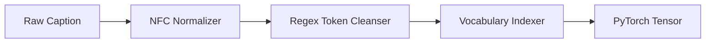

# Bengali NLP Preprocessing Pipeline Specification

```mermaid
graph LR
    Raw[Raw Caption] --> NFC[NFC Normalizer]
    NFC --> Clean[Regex Token Cleanser]
    Clean --> Vocab[Vocabulary Indexer]
    Vocab --> Tensor[PyTorch Tensor]
```
